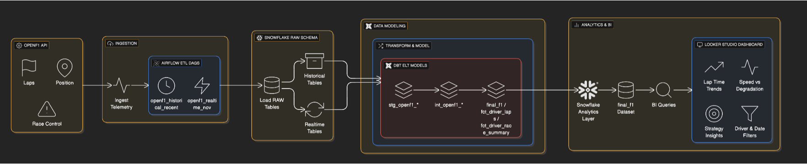
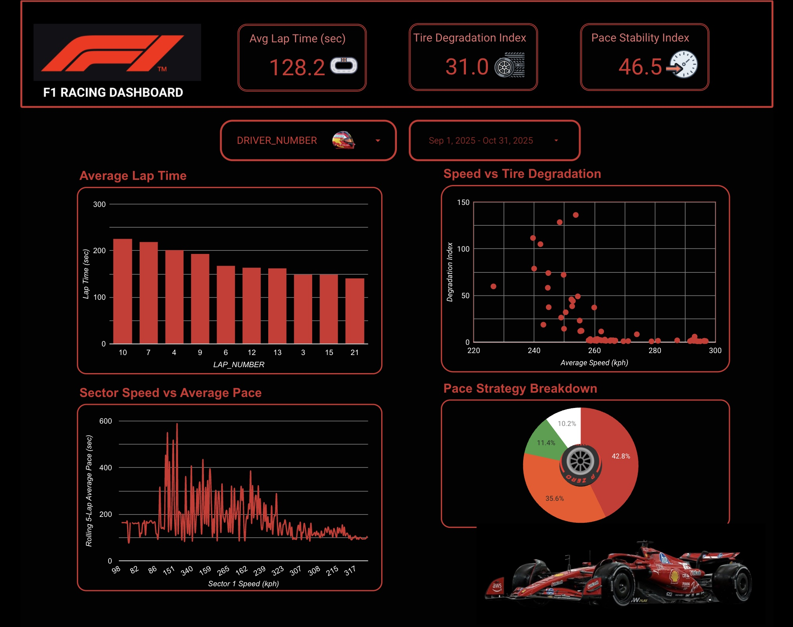

<!--
Tip: Put your images in a folder called `images/` in this repo, then
update the src paths below (banner.png, architecture.png, schema.png, dashboard.png).
-->

<p align="center">
  
</p>

<h1 align="center">F1 Performance Analytics Platform</h1>

<p align="center">
  End-to-end Formula 1 analytics built with OpenF1, Airflow, Snowflake, dbt and Looker Studio.
</p>

---

## 🔍 Overview

This project builds a complete **Formula 1 performance analytics platform** that ingests **historical and real-time data** from the OpenF1 API, processes it through a modern data stack, and surfaces insights via an interactive dashboard.

---

## ✨ Main Features

- 📡 Automated ingestion of **historical + real-time** F1 data using **Airflow**
- 🧊 Centralized storage and querying in **Snowflake**
- 🧱 **dbt** models for data cleaning, normalization, and semantic layers
- 🧮 Feature engineering for:
  - Pace momentum
  - Tire degradation index
  - Rolling pace stability (std dev)
  - Driver/session summary metrics
- 📊 **Looker Studio dashboard** with interactive filters (driver, date, session)

---

## 🧱 Architecture

<p align="center">
  
</p>

**High-level components:**

- **OpenF1 API** – raw lap, session, and telemetry data  
- **Airflow** – orchestrates:
  - Weekly historical loads (rolling 120-day window)
  - Daily real-time loads (latest completed session)
- **Snowflake** – cloud data warehouse for all staged and modeled data
- **dbt** – transformations, feature engineering, and mart creation
- **Looker Studio** – visualization and reporting layer

---

## 🗂️ Database Schema

Key models include:

- `stg_openf1_*` – raw → clean staging tables  
- `int_unified_laps` – merged historical + real-time laps  
- `fct_driver_laps` – lap-level fact table with engineered metrics  
- `fct_driver_race_summary` – driver/session summaries  
- `final_f1` – unified model for dashboard consumption  

---

## 🔄 Data Pipeline

### 1️⃣ Historical Pipeline (Weekly)

- Loads a **rolling 120-day window** of races and qualifying sessions  
- Cleans and deduplicates data  
- Tags records with `is_realtime = FALSE`  
- Ensures consistent schema and types for long-term analysis  

### 2️⃣ Real-Time Pipeline (Daily)

- Detects the **latest completed session** via the OpenF1 API  
- Deduplicates laps using `ROW_NUMBER()` over timestamps  
- Tags records with `is_realtime = TRUE`  
- Fully reloads the latest session (idempotent: delete → insert)

### 3️⃣ Session-Aware Logic

- Historical pipeline **excludes** the latest session  
- Real-time pipeline **owns** the latest session  
- Prevents double-counting and guarantees deterministic processing

---

## 🧮 Transformations & Features (dbt)

- Standardizes types (`INT`, `FLOAT`, timestamps, booleans)
- Replaces null-like strings with real `NULL` values
- JSON-encodes lists/dicts for safe storage
- Adds derived metrics such as:
  - Lap time deltas
  - Pace momentum vs previous laps
  - Tire degradation index
  - Rolling lap-time variance (pace stability)
  - Position gains/losses over segments

These models feed directly into the dashboard for rich F1 analytics.

---

## 📊 Dashboard

<p align="center">
  
</p>

**Key visuals:**

- **KPI cards** – average lap time, tire degradation index, pace stability index  
- **Average Lap Time per Lap** – lap-by-lap performance trend  
- **Speed vs Tire Degradation** – scatter plot showing the tradeoff between pace and tire wear  
- **Sector Speed vs Average Pace** – sector performance vs rolling lap average  
- **Pace Strategy Breakdown** – donut chart illustrating time spent in different pace/strategy modes  


```text 
https://lookerstudio.google.com/reporting/4faa7e79-f8af-450b-9ac7-f9c3d0755488
